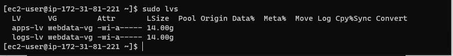

## In this project i will prepare storage infrastructure on two Linux servers and implement a basic web solution using WordPress


I will configure storage subsystem for Web and Database servers based on Linux OS. Also demonstrate the process of working with disks, partitions and volumes in Linux.

I will install WordPress and connect it to a remote MySQL database server, while deploying Web and DB tiers of Web solution.

I will be using RedHat OS

**LAUNCH AN EC2 INSTANCE THAT WILL SERVE AS “WEB SERVER**


**CREATING AND MOUNTING VOLUMES**

Create 3 volumes in the same AZ as your Web Server EC2, each of 10 GiB.


Attach all three volumes one by one to your Web Server EC2 instance

Open up the Linux terminal to begin configuration

Use *lsblk* command to inspect what block devices are attached to the server.

`lsblk`


Use *df -h* command to see all mounts and free space on your server


Use *gdisk* utility to create a single partition on each of the 3 disks

`sudo gdisk /dev/xvdh`


Use *lsblk* utility to view the newly configured partition on each of the 3 disks


Install *lvm2* package using *sudo yum install lvm2*. 

`sudo yum install lvm2`


Run *sudo lvmdiskscan* command to check for available partitions.

`sudo lvmdiskscan`


**Note**: Previously, in Ubuntu we used *apt* command to install packages, in RedHat/CentOS a different package manager is used, so we shall use *yum* command instead.

Use *pvcreate* utility to mark each of 3 disks as physical volumes (PVs) to be used by LVM

```
sudo pvcreate /dev/xvdf1
sudo pvcreate /dev/xvdg1
sudo pvcreate /dev/xvdh1
```


Verify that your Physical volume has been created successfully by running *sudo pvs*


Use *vgcreate* utility to add all 3 PVs to a volume group (VG). Name the VG **webdata-vg**

`sudo vgcreate webdata-vg /dev/xvdh1 /dev/xvdg1 /dev/xvdf1`


Verify that your VG has been created successfully by running *sudo vgs*

`sudo vgs`

Use lvcreate utility to create 2 logical volumes. **apps-lv (Use half of the PV size)**, and **logs-lv Use the remaining space of the PV size. NOTE**: apps-lv will be used to store data for the Website while, logs-lv will be used to store data for logs.

```
sudo lvcreate -n apps-lv -L 14G webdata-vg
sudo lvcreate -n logs-lv -L 14G webdata-vg
```

Verify that your Logical Volume has been created successfully by running *sudo lvs*



Verify the entire setup

`sudo vgdisplay -v #view complete setup - VG, PV, and LV`

`sudo lsblk `


Use *mkfs.ext4* to format the logical volumes with *ext4* filesystem

```
sudo mkfs -t ext4 /dev/webdata-vg/apps-lv
sudo mkfs -t ext4 /dev/webdata-vg/logs-lv
```


Create **/var/www/html** directory to store website files

`sudo mkdir -p /var/www/html`

Create **/home/recovery/logs** to store backup of log data

`sudo mkdir -p /home/recovery/logs`

Mount **/var/www/html** on *apps-lv* logical volume

`sudo mount /dev/webdata-vg/apps-lv /var/www/html/`

Use *rsync* utility to backup all the files in the log directory **/var/log** into **/home/recovery/logs** (This is required before mounting the file system)

`sudo rsync -av /var/log/. /home/recovery/logs/`


Mount **/var/log** on **logs-lv** logical volume. (Note that all the existing data on /var/log will be deleted. That is why step 15 above is very
important)

`sudo mount /dev/webdata-vg/logs-lv /var/log`

Restore log files back into **/var/log** directory

`sudo rsync -av /home/recovery/logs/. /var/log`

Update */etc/fstab* file so that the mount configuration will persist after restart of the server.

**UPDATE THE */ETC/FSTAB* FILE**

The UUID of the device will be used to update the */etc/fstab* file;

`sudo blkid`

`sudo vi /etc/fstab`

Update */etc/fstab* in this format using your own UUID and rememeber to remove the leading and ending quotes.


Test the configuration and reload the daemon

```
 sudo mount -a
 sudo systemctl daemon-reload
 ```


 Verify your setup by running *df -h*, output must look like this

 `df -h`


 ## Prepare the Database Server

 Launch a second RedHat EC2 instance that will have a role – ‘DB Server’
 
 Repeat the same steps as for the Web Server, but instead of *apps-lv* create *db-lv* and mount it to */db* directory instead of */var/www/html/*.

 ## Install WordPress on your Web Server EC2


Update the repository

`sudo yum -y update`


Install wget, Apache and it’s dependencies

`sudo yum -y install wget httpd php php-mysqlnd php-fpm php-json`


Start Apache

```
sudo systemctl enable httpd
sudo systemctl start httpd
```


To install PHP and it’s depemdencies

```
sudo yum install https://dl.fedoraproject.org/pub/epel/epel-release-latest-8.noarch.rpm
sudo yum install yum-utils http://rpms.remirepo.net/enterprise/remi-release-8.rpm
sudo yum module list php
sudo yum module reset php
sudo yum module enable php:remi-7.4
sudo yum install php php-opcache php-gd php-curl php-mysqlnd
sudo systemctl start php-fpm
sudo systemctl enable php-fpm
setsebool -P httpd_execmem 1
```


Restart Apache

`sudo systemctl restart httpd`


Download wordpress and copy wordpress to *var/www/html*

```
mkdir wordpress
cd   wordpress
sudo wget http://wordpress.org/latest.tar.gz
sudo tar xzvf latest.tar.gz
sudo rm -rf latest.tar.gz
cp wordpress/wp-config-sample.php wordpress/wp-config.php
cp -R wordpress /var/www/html/
```

  

Configure SELinux Policies

```
  sudo chown -R apache:apache /var/www/html/wordpress
  sudo chcon -t httpd_sys_rw_content_t /var/www/html/wordpress -R
  sudo setsebool -P httpd_can_network_connect=1
```
  


## Install MySQL on your DB Server EC2

```
sudo yum update
sudo yum install mysql-server
```

 

Verify that the service is up and running by using *sudo systemctl status mysqld*, if it is not running, restart the service and enable it so it will be running even after reboot


## Configure DB to work with WordPress

```
sudo mysql
CREATE DATABASE wordpress;
CREATE USER `myuser`@`<Web-Server-Private-IP-Address>` IDENTIFIED BY 'mypass';
GRANT ALL ON wordpress.* TO 'myuser'@'<Web-Server-Private-IP-Address>';
FLUSH PRIVILEGES;
SHOW DATABASES;
exit
```


## Configure WordPress to connect to remote database

**Hint**: Do not forget to open MySQL port 3306 on DB Server EC2. For extra security, you shall allow access to the DB server **ONLY** from your Web Server’s IP address, so in the Inbound Rule configuration specify source as /32


Install MySQL client and test that you can connect from your Web Server to your DB server by using *mysql-client*

```
sudo yum install mysql
sudo mysql -u admin -p -h <DB-Server-Private-IP-address>
```


Verify if you can successfully execute *SHOW DATABASES;* command and see a list of existing databases


Change permissions and configuration so Apache could use WordPress

Enable TCP port 80 in Inbound Rules configuration for your Web Server EC2 (enable from everywhere 0.0.0.0/0 or from your workstation’s IP)

Try to access from your browser the link to your WordPress *http://<Web-Server-Public-IP-Address>/wordpress/*

If you see this message – it means your WordPress has successfully connected to your remote MySQL database


# Congratulations!

